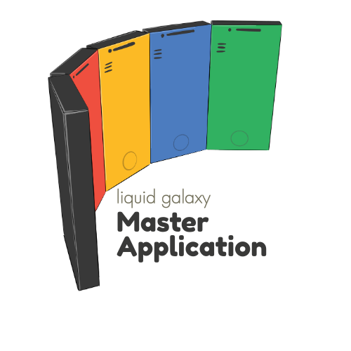

<div><center>
  
</center></div>


# Liquid Galaxy Master Web and Flutter Application 


## INDEX

1. [Introduction. What is this guide, and how does it work?](#id1)
2. [Basic concepts](#id2)  
   2.1. [What is Liquid Galaxy?](#id21)  
   2.2. [What is Flutter?](#id22)  
3. [Start your project](#id3)  
   3.1. [Code structure](#id31)
   3.2. [How a Dart project works](#id32)   
5. [Projects used to create this project](#id4)  

---

<h2 id="id1"> 1. Introduction. What is this guide, and how does it work? </h2>

Welcome to GSoC and congratulations on being selected! Now that you have to focus on starting your project, this document aims to be a guide to make this whole process a lot easier.
The code archive will give you a structure on how your application should look like as well as some coding tips, and this written guide serves as a complement to that same code archive. Here you will find information on Liquid Galaxy, Flutter, and Flutter applied to Google Earth in case you have never used them. You will also find tips and advice on how to start your project, as well as how to solve different problems that you may encounter.


<h2 id="id2"> 2. Basic concepts </h2>

<h3 id="id21"> 2.1. What is Liquid Galaxy? </h3>
The Liquid Galaxy is an open-source project founded by Google that enables users to navigate Google Earth, view videos and photos, create interactive tours, and visually display GIS (Geographic Information System) data. It is made up of a 7-screen display, connected together to provide users an immersive panoramic experience. Created in 2008 by Google employee Jason Holt, Liquid Galaxy started out as a panoramic, multiscreen viewer for Google Earth. Since then, it has become a tool used for more than just exploring the Earth, as it is now also used for data visualization, virtual tours, videos, photos, and more. Here's how it works:

- **Each screen is powered by its own computer.**  The Liquid Galaxy hardware consists of 3 or more computers driving multiple displays, with usually one computer for each display.
- **The Liquid Galaxy applications are developed using master/slave architecture.** The master screen controls the view, and the other screens (the "slaves") are set up to follow it. When the user moves around on the master screen, the other screens adjust their views to stay in sync, creating a smooth, panoramic effect. This coordination is handled through messages sent over a network using UDP.

Even though Liquid Galaxy often uses Google Earth, it is a separate open-source project. This means developers can create open-source applications to display many types of content in an immersive panoramic environment. As a fun fact, Google Earth itself is not open-source software, although it is free to use.
Companies, nonprofits, and universities often use Liquid Galaxy to present information in a more engaging and interactive way. Google also regularly uses Liquid Galaxy to show and promote its own geospatial technologies at trade shows and exhibits.

<h3 id="id22"> 2.2. What is Flutter? </h3>

Flutter is a cross-platform UI toolkit designed to allow developers to reuse code across different operating systems, such as iOS, Android, web, and desktop, while also allowing apps to interact directly with the features of each platform. The goal is to help developers create high-performance apps for many platforms using mostly the same code, instead of writing separate code for each system. Flutter is open source, meaning anyone can use and contribute to it.
Flutter is known for its fast development. During development, Flutter apps run in a Virtual Machine (VM) that offers a feature called Hot Reload, which allows developers to instantly see the changes made in the app without the need for a full recompile. When the app is ready to be released, Flutter apps are compiled directly to machine code or to JavaScript (if targeting the web), so they run efficiently. Flutter is also known for its flexible UI and its native performance, as Flutter runs smoothly on both iOS and Android. This is because Flutter uses its own high-performance engine, and its widgets include built-in support for platform-specific behaviours like scrolling, navigation, fonts, and icons.
Flutter apps are written in a programming language called Dart. When an app is built, Flutter turns the Dart code into machine code to make sure it runs efficiently. Flutter is built using different layers, each one with its own role. Working from the bottom to the top, we have:

#### Key Features:

- **Basic foundational classes and services.** They provide reusable building blocks for the rest of the system. These include features like animation or painting.
- **Rendering layer.** Controls layout and display. It allows building a tree of visual objects that can be manipulated dynamically and that automatically updates as the app changes.
- **Widgets layer.** It lets developers create the user interface using small building blocks called widgets. Each object from the rendering layer has a corresponding class in this layer. Widgets can be combined and reused. This is also the layer where the reactive programming model is introduced.
- **Material and Cupertino libraries.** These provide a comprehensive sets of controls that, using the widget layer, implement Google's Material or Apple's iOS design languages.
Flutter uses a reactive programming style, which means that, instead of constantly updating the screen manually every time something changes, it is the framework that updates the interface at runtime when the application state changes. The developer describes how the UI should look based on the current app state, and Flutter takes care of updating the screen automatically when things change, similar to a smart assistant keeping the app in sync.
In contrast, most traditional UI frameworks describe the user interface once and then developers must manually update it later when things change. As apps get more complex, this can become hard to manage because changes in one part of the app can affect many others. Flutter also has a huge collection of plugins and packages that add extra functionality, such as camera access, webviews, payments, and more.


<h2 id="id3"> 3. Start your project </h2>

<h3 id="id31"> 3.1. Code structure </h3>

Ensure you install the **Dart extension**.

Project structure example:

```plaintext
your_Project/
│
├── lib/
│   ├── main.dart
│   ├── config/
│   │   └── lg_config.dart
│   │
│   ├── services/
│   │   └── lg_connection.dart
│   │
│   ├── optional_files/
│   │   ├── lg_ai.dart
│   │   ├── lg_google_earth.dart
│   │   └── lg_nodejs.dart
│   │
│   ├── screens/
│   │   ├── connection_screen.dart
│   │   ├── main_screen.dart
│   │   ├── help_screen.dart
│   │   └── settings_screen.dart
│   │
│   ├── ai/
│   │   └── api_config.dart
│   │
│   ├── nodejs/
│   │   ├── server.js
│   │   └── package.json
│   │
│   ├── kml/
│   │   └── example.kml
│   │
│   ├── models/
│   │
│   ├── providers/ (optional?)
│   ├── utils/ (optional?)
│   │
│   ├── linux/ (optional, depending on if you want your project to be visualized in this technology)
│   │
│   ├── macOS/ (optional, depending on if you want your project to be visualized in this technology)
│   │
│   ├── web/ (optional, depending on if you want your project to be visualized in this technology)
│   │
│   └── windows/ (optional, depending on if you want your project to be visualized in this technology)
│
├── test/
│     └── lg_service_test.dart
│
├── pubspec.yaml
├── README.md
└── .gitignore
```

- `lib/`.
- `main.dart`. The 'main' archive serves to execute the app and show the main screen (HomeView). It is the entry point of the Flutter application.
- `utils/`. Utility files. They can help to maintain consistency through the app and to make it easy to manage global settings and styles, for example.

<h3 id="id32"> 3.2. How a Dart project works </h3>

If you make changes to your app, if you want to run it and see those changes you have to rebuild the app.
- flutter clean
- flutter pub get
- flutter run or run the emulation using Android Studio

<h2 id="id4"> 4. Projects used to create this project </h2>

| Project Title | Contributor | Year | Technologies / Languages |
|---------------|-------------|------|---------------------------|
| [LG Ship Automatic Identification System Visualization](https://github.com/LiquidGalaxyLAB/LG-Ship-Automatic-Identification-System-visualization) | Rofayda Bassem | 2024 | Dart (95.6%), C++ (2.2%), CMake (1.8%), Swift (0.2%), C (0.1%), HTML (0.1%) |
| [Super Liquid Galaxy Controller](https://github.com/LiquidGalaxyLAB/Super-Liquid-Galaxy-Controller) | Aritra Biswas | 2024 | Dart (98.6%), C++ (0.7%), CMake (0.5%), Swift (0.1%), HTML (0.1%) |
| [LG Gemini AI Touristic Tool](https://github.com/LiquidGalaxyLAB/LG-Gemini-AI-Touristic-info-tool) | Sidharth Mudgil | 2024 | Dart (100.0%) |
| [La Palma VolTrac](https://github.com/LiquidGalaxyLAB/La-Palma-Volcano-Eruption-Tracking-Tool) | Yash Raj Bharti | 2022 | Dart (100.0%) |
| [SatNOGS Visualization Tool](https://github.com/LiquidGalaxyLAB/SatNOGS-Visualization-Tool) | Michell Algarra | 2022 | Dart (89.0%), C++ (6.2%), CMake (2.9%), HTML (1.4%), C (0.3%), Swift (0.1%), Other (0.1%) |
| [Image Satellite Visualizer](https://github.com/LiquidGalaxyLAB/image-satellite-visualizer) | Octávio Müller | 2021 | Dart (96.0%), HTML (1.8%), Objective-C (0.7%), Ruby (0.7%), Java (0.5%), Swift (0.2%), Kotlin (0.1%) |
| [Liquid Galaxy Controller Application](https://github.com/LiquidGalaxyLAB/lg_controller) | Sreyas Ravichandran | 2019 | Dart (98.5%), Other (1.5%) |

---

